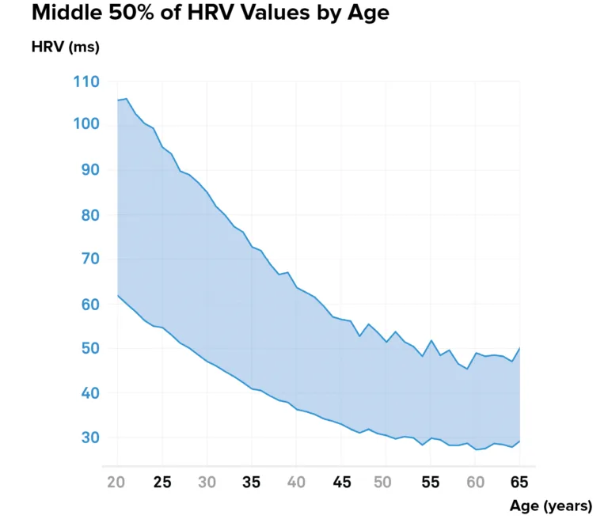
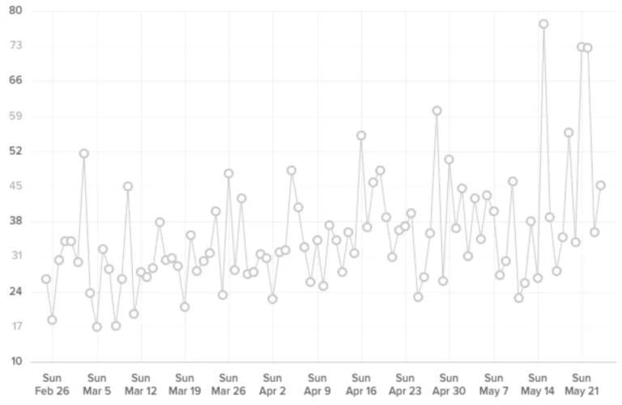

# Stress_Detection

This is a directory for Stress detection using simple statistical methods, Machine Learning and Deep Learning models

The purpose of this repository is to find, test and create new processes for stress detection. In this repository we will test the performance of simple statistical models, machine learning and deep learning models in order to find the best solution for the problem of stress detection. from Additionally we will link below some of the datasets that we are going to test the models on.

## Datasets

1. [Nurse Stress Prediction Wearable Sensors](https://www.kaggle.com/datasets/priyankraval/nurse-stress-prediction-wearable-sensors): Similarly in this dataset we use the heart rate data in order to calculate heart rate variability that is going to be used for the models.

2. [SWELL dataset](https://www.kaggle.com/datasets/qiriro/swell-heart-rate-variability-hrv): This dataset comprises of heart rate variability (HRV) indices computed from the multimodal SWELL knowledge work (SWELL-KW) dataset for research on stress and user modeling, see [SWELL-KW](http://cs.ru.nl/~skoldijk/SWELL-KW/Dataset.html).

3. [Stress-Predict-Dataset](https://github.com/italha-d/Stress-Predict-Dataset): This dataset is associated with "Stress Monitoring Using Wearable Sensors: A Pilot Study and Stress-Predict Dataset" paper.

4. [Heart Rate Prediction to Monitor Stress Level](https://www.kaggle.com/datasets/vinayakshanawad/heart-rate-prediction-to-monitor-stress-level): The data comprises various attributes taken from signals measured using ECG recorded for different individuals having different heart rates at the time the measurement was taken. These various features contribute to the heart rate at the given instant of time for the individual.

## Libraries

We also used a set of custom libraries created by other authors in order to have a better understanding of the data and create a better Explanatory Data Analysis. Some of those libraries are:

1. [pyhrv](https://github.com/PGomes92/pyhrv)
2. [hrv-analysis](https://github.com/Aura-healthcare/hrv-analysis)
3. [wearable-hrv](https://github.com/AminSinichi/wearable-hrv)
4. [Stress-Prediction-Using-HRV](https://github.com/realmichaelye/Stress-Prediction-Using-HRV)
5. [Stress Prediction using Wearable Device Data](https://github.com/kjspring/stress-detection-wearable-devices)

## Strategy

In the design of our architecture for Stress Detection we decided to use off the self devices that we can use in order to get heart rate measurements.
In this directory we are going to use the heart rate data in order to get HRV metrics like SDNN and RMSSD. Using these metrics we are going to create
three different approaches to stress detection. Now HRV is a concept that refers to the variation in time between heartbeats, and it’s quantified
through various metrics — not just one.

| Metric  | Meaning                                                                                               |
| ------- | ------------------------------------------------------------------------------------------------------|
| SDNN    |Standard deviation of all NN (normal-to-normal) intervals. Reflects overall HRV                        |
| RMSSD   |Root mean square of successive RR differences. Sensitive to short-term vagal (parasympathetic) activity|

Since we have a 2-5-minute window of values, we can use PPG-derived (photoplethysmography) approximated RR intervals from HR and return RMSSD as the
main HRV value.

## Theoretical Background

Although HRV manifests as a function of the heart rate, it actually originates from the nervous system. The autonomic nervous system, which controls the involuntary aspects of the physiology, has two branches, parasympathetic (deactivating) and sympathetic (activating). The parasympathetic nervous system handles inputs from internal organs, like digestion or your fingernails and hair growing. It causes a decrease in heart rate. The sympathetic nervous system reflects responses to things like stress and exercise, and increases your heart rate and blood pressure. Heart rate variability comes from these two
competing branches simultaneously sending signals to your heart. If your nervous system is balanced, your heart is constantly being told to beat slower
by your parasympathetic system, and beat faster by your sympathetic system. This causes a fluctuation in your heart rate: **HRV**.

When somebody has high a heart rate variability, it means that the body is responsive to both sets of inputs (parasympathetic and sympathetic). This is
a sign that the nervous system is balanced, and that your body is very capable of adapting to its environment and performing at its best. On the other hand, if somebody has a low heart rate variability, one branch is dominating (usually the sympathetic) and sending stronger signals to your heart than the other.

There are times when this is a good thing--like if somebody is running a race we want the body to focus on allocating resources to your legs (sympathetic activity) as opposed to digesting food (parasympathetic activity). However, if you’re not doing something active low HRV indicates your body is working hard for some other
reason (maybe you're fatigued, dehydrated, stressed, or sick and need to recover), which leaves fewer resources available to dedicate towards exercising, competing,
giving a presentation at work, etc.

### Normal Heart Rate Variability

### Heart Rate Variability Trends are What Matters

When you begin using a heart rate variability monitor, you may notice that your HRV varies greatly from day to day. This can be attributed to the many
factors that affect it, and is perfectly normal. If your friend has a higher HRV than you do today, that is not an indication that they are more fit
than you are. Rather than comparing your heart rate variability to others, a more practical use of HRV is to follow your own long-term trends. For
example, if you’re taking steps to improve your fitness and overall health, over time you should see a gradual increase in your average heart rate
variability.

### Is it better to have high or low HRV?

In general, a higher heart rate variability (HRV) is considered better as it indicates a more adaptable and resilient autonomic nervous system, which can respond effectively to different stressors. Conversely, a low HRV may be associated with an increased risk for various health problems, such as
cardiovascular disease, depression, and anxiety. However, any major deviation outside of your typical range can represent an imbalance of the autonomic nervous system.
